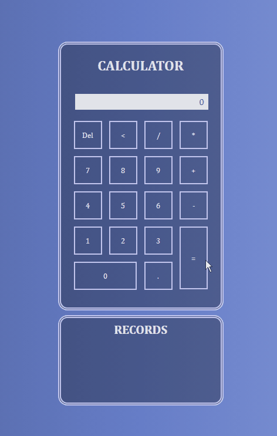
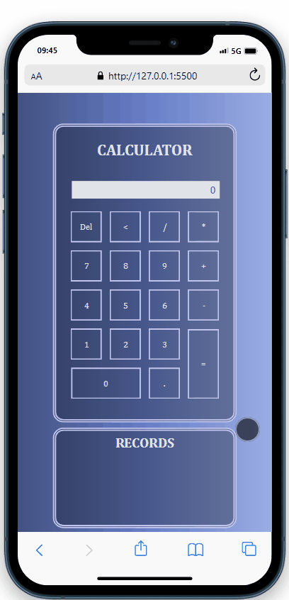

<h1>CALCULATOR</h1>

<h3>Are you tired of resolving math? You don't need to worry anymore!</h3>
<h3>The calculator will resolve your problems.</h3> 

<b>This project</b>

  <a href="#about">About</a> . 
  <a href="#prerequisites">Prerequisites</a> . 
  <a href="#technologies">Technologies</a> . 
  <a href="#author">Author</a>

 

<h2>About</h2>
 
This project was made in order to study and learn more about HTML, CSS and Javascript.
 
But if you are here and have some math to do feel free to use the Calculator.
  
Look how it looks like:
  

&nbsp;&nbsp;&nbsp;&nbsp;&nbsp;&nbsp;&nbsp;&nbsp;&nbsp;&nbsp;

 

<h2>Prerequisites</h2>
 
Before starting you need to have <a href="https://git-scm.com/downloads">Git</a> installed in your machine. 
Also it's good to have an editor to work with the code like <a href="https://code.visualstudio.com/">VSCode</a>.
  
<ul>
<li>Open Git in your computer.</li>
<li>Go to the folder where you wanna clone the files typing: cd "URL OF WHERE YOU WANT TO CLONE"</li>
<li>And to clone the files type: git clone "https://github.com/LenitoArruda/calculator"</li>
</ul>
 

<h2>Technologies</h2>
 
<ul>
<li>HTML</li>
<li>CSS</li>
<li>Javascript</li>
</ul>
 

<h2>Author</h2>
 
This project was made by Lenito Arruda. 
  
<h3>Follow me on my social media:</h3>
 

